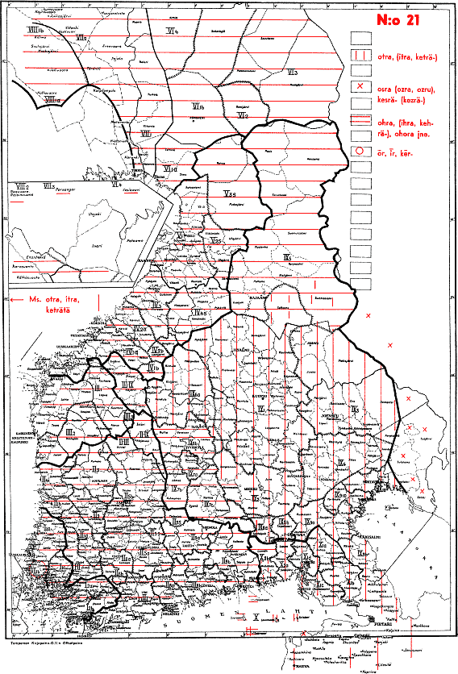

```{r setup, include=FALSE}
knitr::opts_chunk$set(warning=FALSE, message=FALSE, error=FALSE, dpi = 400,fig.cap = "", cache = T, echo=TRUE)
library(tidyverse)
library(glue)
```

## Winter School 2018, Vienna {data-background-image="map_small1.jpg" data-background-size="100%" .textbox}

---------------------------------------------------------------------

## Data analysis for Uralists {data-background-image="map_small2.jpg" data-background-size="100%" .textbox}
### About emerging possibilities

### Niko Partanen

# What is this?

- A presentation Niko Partanen had in Winter School of Finno-Ugric studies
- Small modifications have been made since the presentation in order to make sure everything is explained and easy to follow

## How does this work?

    git clone https://github.com/nikopartanen/winterschool2018
    cd winterschool2018

Download this file (LINK COMING SOON), and place it into folder called `data`. The path into file should be:

> `winterschool2018/data/skn_df.rds`.

`rds` file is simply a file that is nicely compressed and can be read into R either by function `read_rds()` or `readRDS()`.

## RStudio

- Not obligatory, but likely the easiest way to work with R is in RStudio
- Install it from here
- Open file `winterschool2018.Rproj` in RStudio
- You should now have the same files open as I have on my laptop

## Code blocks

- The file this presentation is built from contain lots of little pieces of R code scattered into the document
- These are important, since the analysis and exploration is done by executing these lines
- In RStudio you can always select lines and click `Run > Run Selected Line(s)`
- Lines starting with hashtag `#` character are comments
- In the comments I try to explain better what is being done

# Introduction

---------------------------------------------------------------------

- Me
- Selfish advertising
- Some background


<aside class="notes">

- A linguist with MA in Finno-Ugristics
- Komi is an Uralic language
    - Occasionally I also touch Udmurt and Karelian
- I've worked last year in LATTICE laboratory in Paris
    - Work there focuses to dependency parsing
- I'm more than happy to come teach a course about R or linguistic analysis in your institution!

</aside>

---------------------------------------------------------------------

## How do we work with these languages?

## What kind of data we have?

## What do we do with that data?

# Some examples and suggestions

## Skipping the interfaces

> - Learning ordinary tools of data analysis
    - Primarily R and/or Python?
> - Thinking how to represent linguistic data
    - What is different? What is same?
> - Applying these workflows into linguistic data
> - 80% general, 20% domain specific
    - (said someone in Twitter)

# Suomen kielen näytteitä

##

> Kotimaisten kielten keskus (2014). Suomen kielen näytteitä -korpuksen Helsinki-Korp-versio [tekstikorpus]. Kielipankki. Saatavilla http://urn.fi/urn:nbn:fi:lb-2016042702

## {data-background="https://imgur.com/26xOFi5.png" data-background-size="90%"}

## {data-background="https://imgur.com/aL6yc5v.png" data-background-size="90%"}

```{r, echo=FALSE}

# Here we load some libraries

library(leaflet) # for maps
library(htmlwidgets) # for html widgets, i.e. interactive content online
library(widgetframe) # not really needed, but this presentation template works better with this

# First I read a file that contains a list of settlements that are in SKN corpus, alongside the coordinates

location_map <- read_csv("../finnicdata/data/skn_paikat.csv") %>% 
  leaflet() %>%
  addTiles() %>%
  addCircleMarkers(popup = ~paikka, radius = 5, color = "black", weight = 2, fillColor = "gray")

# In this point we create a map that has small circle popups for each `paikka` value in the spreadsheet.

```

##

```{r, echo=FALSE}
# Here the map is added on its own slide
frameWidget(location_map, height = 700)
```

```{r read_skn_rds, echo=FALSE, cache=TRUE}

# Here the actual corpus is being read.

skn <- read_rds("../finnicdata/data/skn_df.rds") %>% rename(token_norm = sane,
               token_orig = alkup,
               token = norm,
               morph = msd,
               time_rec = nauhoitusaika,
               participant = puhuja,
               gender = sukupuoli,
               dialect = murre,
               dialect_area = murrealue,
               role = rooli) %>%
  left_join(read_csv("../finnicdata/data/skn_paikat.csv")) %>%
  rename(country = maa,
         location = paikka,
         latitude = lat,
         longitude = lon) %>%
  arrange(id, position) %>%
  filter(role == "haastateltava") %>%
  mutate(time_rec = as.numeric(time_rec)) %>%
  select(token, token_norm, location, time_rec, everything())
```

##

```{r}
# select() can be used to pick individual columns
skn %>% select(token)
```

##

```{r}
skn %>% select(token, token_norm)
```

##

```{r}
skn %>% select(token, token_norm, location)
```

##

```{r}
skn %>% select(token, token_norm, location, time_rec)
```

##

```{r}
skn %>% select(token, token_norm, location, time_rec, participant, dialect_area)
```

## This is what metadata is for!

##

```{r}
skn %>% select(token, token_norm)
```

##

```{r}
skn %>% select(token, token_norm, lemma)
```

##

```{r}
skn %>% select(token, token_norm, lemma, pos, morph)
```


##

```{r}
skn %>% select(token, token_norm, lemma, pos, morph, dephead, deprel)
```

##

- One observation is one row
- One token is one observation
- One phoneme works well too
<!-- - [All audio is also available!](https://lat.csc.fi/ds/annex/runLoader?nodeid=MPI7571%23&time=50629&duration=21106&tiername=RJ-original)-->

## {data-background="https://imgur.com/8sTjpdV.png"}

##

```{r, echo=TRUE}
# Plotting is also easy, once you learn the syntax
skn_plot <- ggplot(data = skn,
                   aes(x = time_rec)) +
                   geom_bar()
```

##

```{r, echo=FALSE}
skn_plot
```

##

```{r}
# filter selects rows that match some condition
# here the search is "everything where the normalized token is 'metsä'"
skn %>% filter(token_norm == "metsä")
```

##

```{r}
# This query has several conditions
skn %>% filter(lemma == "syödä" & morph == "PRS_Sg3|VOICE_Act|TENSE_Prs|MOOD_Ind")
```

##

```{r}
# str_detect is an easy to use regular expressions
skn %>% filter(str_detect(token_norm, "^metsä"))
```

##

```{r}
# with many Uralic languages you get really far 
# just by matching strings
skn %>% filter(str_detect(token, ".+stä$"))
```

##

```{r}
# another example
skn %>% filter(lemma =="metsä" & str_detect(morph, "CASE_Ill"))
```

## 

- In principle any queries can be written this way
- Eventually gets complicated, but what doesn't? 

# Kettunen

## Traditional view {data-background-image="kett001_clusters.png" data-background-size="40%" .textbox}

##

- [Kettunen's dialect atlas](https://avaa.tdata.fi/web/kotus/aineistot) has been made available with CC-BY license. 

## Combining the approaches

##

```{r}
# Here I reuse a function I wrote long time ago
# you basically need to invent everything only once
# and most of the things someone else has already done
source("https://raw.githubusercontent.com/langdoc/finnic_atlas/master/R/map_finnic.R")
frameWidget(map_finnic(1))
```

##

```{r}
# If we want to build ggplot2-style maps, ggmap
# is probably the easiest option
library(ggmap)

# We can get the area of Finland by defining coordinates for
# extremities of the bounding box
finland <- c(left = 18, bottom = 58, right = 33, top = 71)

# this will download the map
map <- get_stamenmap(finland, zoom = 5, maptype = "toner-lite")

# Here we are picking up all those examples where 
# these consonant clusters occur
clusters <- skn %>%
  filter(str_detect(token_norm, "^(pl|pr|kl|kr)")) %>%
  mutate(variable = str_extract(token_norm, "^.{2}")) %>%
  select(variable, everything()) %>%
  distinct(variable, location, .keep_all = TRUE)

# Here we are picking up all those examples where 
# these consonant clusters occur, they are rarer,
# so the variable created is named accordingly.
clusters_rare <- skn %>%
  filter(str_detect(token_norm, "^(sk|st|sp)")) %>%
  mutate(variable = str_extract(token_norm, "^.{2}")) %>%
  select(variable, everything()) %>%
  distinct(variable, location, .keep_all = TRUE)
```

##

```{r, echo=FALSE}
# this plots the common clusters to the map
ggmap(ggmap = map) +
  geom_point(data = clusters, 
             aes(x = longitude, y = latitude, color = variable)) +
  facet_grid(. ~ variable) +
  theme(axis.title=element_blank(),
        axis.text=element_blank(),
        axis.ticks=element_blank())

```

##

```{r, echo=FALSE}
# this adds uncommon clusters
ggmap(ggmap = map) +
  geom_point(data = clusters_rare, 
             aes(x = longitude, y = latitude, color = variable)) +
  facet_grid(. ~ variable) +
  theme(axis.title=element_blank(),
        axis.text=element_blank(),
        axis.ticks=element_blank())

```


##

<!-- One thing I like very much is to define the queries we try to write in plain language, just to highlight that what we are trying to do is really just commonsense thing that in the end demands more linguistic knowledge than anything else -->

> Variable `ts` in the word *metsä* can be found between phoneme sequences [e] and [ä]. The [e] has no variation in this context, but [ä] can be realized in various lengths or zero.

##

```{r}
# This plot contains the occurrences of word metsä,
# but with the affricate only
metsa_plot <- skn %>%
  filter(lemma == "metsä" &  morph == "NUM_Sg|CASE_Nom") %>%
  mutate(variable = str_extract(token_orig, "(?<=e)[^äÄ]+(?=(ä|Ä|ä̀)?)")) %>%
  mutate(variable = str_replace_all(variable, "§", "")) %>%
  select(variable, everything()) %>%
  distinct(variable, location, .keep_all = TRUE) %>%
  leaflet() %>%
  addTiles() %>%
  addLabelOnlyMarkers(~jitter(longitude, 20), ~jitter(latitude, 20), 
                      label =  ~as.character(variable), 
                      labelOptions = labelOptions(noHide = T, 
                                                  direction = 'top', 
                                                  textOnly = T))

```

##

```{r}
frameWidget(metsa_plot, height = 700)
```

##

> 'Ohra' in Finnish is a good word

##



##

```{r}
# This is a comparable map for word 'ohra', now
# with whole word
ohra_map <- skn %>%
  filter(token_norm == "ohra") %>%
  distinct(token, location, .keep_all = TRUE) %>%
  leaflet() %>%
  addTiles() %>%
  addLabelOnlyMarkers(~longitude, ~latitude, 
                      label =  ~as.character(token), 
                      labelOptions = labelOptions(noHide = T, 
                                                  direction = 'top', 
                                                  textOnly = T))
```

##

```{r}
frameWidget(ohra_map, height = 700)
```


# Back to Komi

##

```{r, echo=FALSE}
# this is just an example of how maps can be done with
# lingtypology package
kpv <- read_csv("https://raw.githubusercontent.com/langdoc/kpv-geography/master/kpv.csv")

library(lingtypology)

komi_settlements <- map.feature(languages = kpv$language,
            features = kpv$dialect,
            label = kpv$village,
            latitude = kpv$latitude,
            longitude = kpv$longitude)

```

```{r}
frameWidget(komi_settlements)
```

## Question

<!-- Rest of the slides are just glimpses to my ongoing Komi research, and cannot be reproduced as such. I wanted to add more content, but I had 15 minutes and had to keep it compact. Anyway there was a with to have some Komi material, so there it is. -->

> Verbs in third person plural can have varying realization in the past tense: muniny ~ munisny ~ muninys ~ munisnys are all legit. What is going on?

##


##


##


## Thank you! {data-background-image="https://upload.wikimedia.org/wikipedia/commons/d/dc/La_Nature_se_d%C3%A9voilant_a_la_Science%2C_Mus%C3%A9e_d%27Orsay%2C_photo_by_emilee_rader_2.jpg" data-background-size="100%" .textbox}


##

Kettunen scans online: http://kettunen.fnhost.org

Kotus's atlases in [Avaa Portal](https://avaa.tdata.fi/web/kotus/aineistot).

Thank you image [Wikimedia Commons](https://commons.wikimedia.org/wiki/File:La_Nature_se_d%C3%A9voilant_a_la_Science,_Mus%C3%A9e_d%27Orsay,_photo_by_emilee_rader_2.jpg).

Old maps from National Library of Finland's [Doria-collection](http://www.doria.fi/handle/10024/78800).

[lingtypology](https://github.com/ropensci/lingtypology) is George Moroz's wonderful R package.

<!--
# unused

```{r}
skn %>% filter(str_detect(token, "δ")) %>% count(location, time_rec)

skn %>% filter(str_detect(token, "δ")) %>%
  leaflet() %>%
  addTiles() %>%
  addCircleMarkers(popup = ~location)
```

##

```{r}
skn %>%
  filter(str_detect(token_norm, "^kakso.+")) %>%
  count(location)

skn %>%
  filter(str_detect(token_norm, "^metsä.+")) %>%
  count(location)

skn %>%
  filter(lemma == "metsä" &  morph == "NUM_Sg|CASE_Nom") %>%
  mutate(variable = str_extract(token_orig, "(?<=e)[^äÄ]+(?=(ä|Ä|ä̀)?)")) %>%
  mutate(variable = str_replace_all(variable, "§", "")) %>%
  select(variable, everything()) %>%
  distinct(variable, location, .keep_all = TRUE) %>%
  leaflet() %>%
  addTiles() %>%
  addLabelOnlyMarkers(~jitter(longitude, 20), ~jitter(latitude, 20), 
                      label =  ~as.character(variable), 
                      labelOptions = labelOptions(noHide = T, 
                                                  direction = 'top', 
                                                  textOnly = T))


skn %>%
  filter(token_norm == "ohra") %>%
  distinct(token, location, .keep_all = TRUE) %>%
  leaflet() %>%
  addTiles() %>%
  addLabelOnlyMarkers(~longitude, ~latitude, 
                      label =  ~as.character(token), 
                      labelOptions = labelOptions(noHide = T, 
                                                  direction = 'top', 
                                                  textOnly = T))
```


##


```

-->
